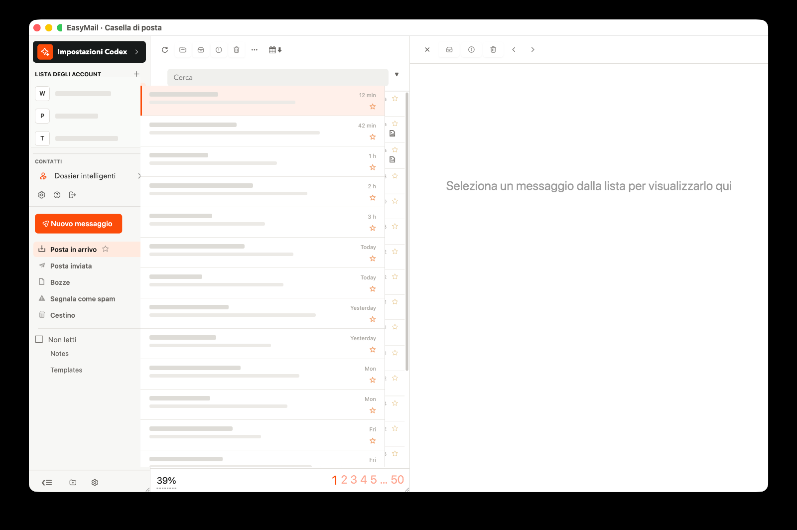

<div align="center">
  

  # EasyMail

  **Email that stays yours. AI when you ask for it.**

  A focused desktop mail client for people who want a calmer inbox, their own writing voice,
  and optional AI support that works beside them instead of taking over.

  [](https://github.com/eduardo-bolognini/snappymail/releases)
  [](#download)
  [](LICENSE)
</div>



## Email first

EasyMail is not an AI inbox with email attached. It is a complete mail client built around the workflows that already matter: IMAP and SMTP, multiple accounts, a unified inbox, folders, search, complete threads, attachments, drafts, encryption, notifications, and familiar reply and forwarding controls.

The interface stays quiet and information-dense. AI appears only in the places where it can be useful, and it can stay disconnected without weakening the mail client.

| You stay in control | EasyMail handles the groundwork |
| --- | --- |
| Read, write, search, organize, and send normally | Runs the full mail core locally inside the desktop app |
| Choose when Codex can help | Keeps its AI home and workspace isolated from Codex on your computer |
| Review every generated draft before sending | Uses a read-restricted mail bridge for context and complete threads |
| Decide which period and contacts to analyze | Builds editable contact dossiers, groups, and writing-style profiles |
| Keep “send without confirmation” disabled by default | Can prepare recipients, subject, body, signature, reply, reply-all, or forward |

## AI, beside you

Codex lives next to the composer as an optional collaborator. Ask it to draft, rewrite, find the right recipients, continue a thread, reply to everyone, or forward a message. It can answer in chat or update the draft, while the final decision remains yours.

When you explicitly run an analysis, EasyMail can study both sides of complete conversations over the period you choose. The result is not a generic “professional tone” preset: it separates how you write from how each contact writes, records evidence, and connects that context to individual people and contact groups. Dossiers remain editable.

The AI layer is deliberately bounded:

- separate app-specific Codex home and workspace;
- restricted read profile for mail analysis;
- approved attachment roots instead of unrestricted filesystem access;
- no automatic corpus analysis until the user connects and starts it;
- no automatic send unless the user explicitly enables it;
- plugin installation and authorization remain explicit actions.

## What ships

- **Self-contained desktop app.** Electron launches a bundled FrankenPHP runtime and the SnappyMail core on loopback. No separate PHP install, Docker container, or hosted SnappyMail instance is required.
- **Any mail provider.** Automatic discovery for known domains, with manual IMAP and SMTP configuration when discovery is unavailable.
- **Multiple accounts.** Account switcher, unified inbox, per-account sender identity, and account-aware notifications.
- **Focused interface.** The Focus theme covers login, mailbox, reading pane, composer, settings, dialogs, responsive layouts, loading states, and reduced motion.
- **Contact intelligence.** Important people, automated senders, editable dossiers, relationship notes, directional writing styles, and real contact groups.
- **Optional Codex tools.** API key or browser login, adaptive reasoning by task, complete-thread context, composer chat, rewrites, and an extensible plugin surface.
- **Automatic updates.** Installed builds consume release metadata from GitHub Releases and install downloaded updates when the app closes.

## Download

Installers are published on the [EasyMail releases page](https://github.com/eduardo-bolognini/snappymail/releases):

- macOS Apple silicon: DMG and ZIP
- Windows x64: NSIS installer
- Linux x64: AppImage and DEB

Community builds may be unsigned until platform signing and notarization are configured. On macOS, confirm the first launch from **System Settings → Privacy & Security** when required.

## Development

Requirements: Node.js 22.12 or newer. The runtime preparation step downloads the pinned FrankenPHP binary for the current platform and verifies its SHA-256 checksum.

```sh
git clone https://github.com/eduardo-bolognini/snappymail.git
cd snappymail/desktop
npm install
npm start
```

Development uses the same local app architecture as packaged builds and binds the mail backend only to `127.0.0.1:38471`. It does not require a remote SnappyMail installation.

Build and verify without starting the app:

```sh
# From the repository root
npm install
npx gulp build

# Desktop tests and packaged application
npm test --prefix desktop
npm run build --prefix desktop
```

Create platform installers with:

```sh
npm run dist --prefix desktop
```

See [desktop/README.md](desktop/README.md) for runtime targets, release signing, update behavior, and the desktop security model.

## Architecture

```text
EasyMail desktop
├── Electron shell
│   ├── context-isolated mail window
│   ├── OS notifications and updates
│   └── narrow preload bridge
├── local FrankenPHP runtime (127.0.0.1 only)
│   └── SnappyMail mail core + Focus theme
└── optional AI sidecar
    ├── isolated Codex home and workspace
    ├── read-restricted mail MCP bridge
    └── editable contacts, groups, and writing profiles
```

Writable mail state lives in the operating system's per-user application directory, outside the application bundle. External navigation opens in the system browser, runtime downloads are checksum-pinned, and the local PHP process stops with the desktop app.

## Built on SnappyMail

EasyMail preserves the mature PHP, IMAP, SMTP, plugin, encryption, settings, and localization architecture of [SnappyMail](https://github.com/the-djmaze/snappymail). This repository is an independent product fork and remains grateful to the SnappyMail and RainLoop contributors whose work makes the mail core possible.

## Status

`0.1.0` is the first public EasyMail desktop release. The product is under active development; review the [EasyMail changelog](EASYMAIL_CHANGELOG.md), the [upstream mail-core changelog](CHANGELOG.md), and [open issues](https://github.com/eduardo-bolognini/snappymail/issues) before relying on it for critical mail workflows.

## License

EasyMail and the underlying SnappyMail code are released under the [GNU Affero General Public License v3.0](LICENSE).

Copyright © 2026 Eduardo Bolognini<br>
SnappyMail copyright © 2020–2024 SnappyMail contributors<br>
RainLoop copyright © 2013–2022 RainLoop contributors
